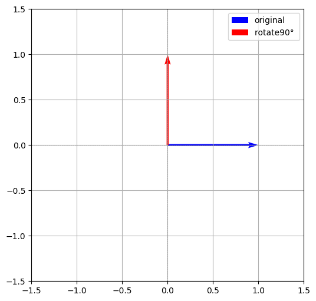

# 一、Sinusoidal PE是什么？
在Transformer原始论文《Attention is All You Need》中，作者使用了固定的**正余弦位置编码**Sinusoidal PE来为模型引入位置信息。其核心思想是利用不同频率的正弦波和余弦波对每个位置进行编码，具体公式如下：
$$
\text{PE}_{(pos, 2i)} = \sin\left(\frac{pos}{10000^{2i/d_{\text{model}}}}\right) \\
\text{PE}_{(pos, 2i+1)} = \cos\left(\frac{pos}{10000^{2i/d_{\text{model}}}}\right)
$$

其中，`pos`表示 token 在序列中的位置，取值范围为[0, 1, 2, ..., seq_len-1]；`i`表示embedding的维度索引，范围为$[0, 1, ..., d_{model}/2 - 1]$，`i`的所有取值总共有$d_{model}/2$个，每一个都分别通过施加sin或cos变换来对应某个token的embedding不同位置的偶数维与奇数维。


为了便于理解，这里来举个实际的例子来演示正余弦位置编码的工作原理。

假设$d_{model}$=8，token序列长度seq_len=120，现在需要计算序列中第2个位置（即`pos`=2）的token对应的位置编码，套公式：

计算每个维度的缩放因子：
| i | 维度 (2i / 2i+1) | $\text{div\_term}_i = 10000^{2i/d_{\text{model}}}$ |
|---|------------------|------------------------------------|
| 0 | 0 / 1            | $10000^{0} = 1$                    |
| 1 | 2 / 3            | $10000^{0.25} \approx 10$          |
| 2 | 4 / 5            | $10000^{0.5} = 100$                |
| 3 | 6 / 7            | $10000^{0.75} \approx 1000$        |

带入公式计算 PE：

$$
\begin{aligned}
\text{PE}(2, 0) &= \sin(2/1) = \sin(2.0) \approx 0.9093 \\
\text{PE}(2, 1) &= \cos(2/1) = \cos(2.0) \approx -0.4161 \\
\text{PE}(2, 2) &= \sin(2/10) = \sin(0.2) \approx 0.1987 \\
\text{PE}(2, 3) &= \cos(2/10) = \cos(0.2) \approx 0.9801 \\
\text{PE}(2, 4) &= \sin(2/100) = \sin(0.02) \approx 0.0200 \\
\text{PE}(2, 5) &= \cos(2/100) = \cos(0.02) \approx 0.9998 \\
\text{PE}(2, 6) &= \sin(2/1000) = \sin(0.002) \approx 0.0020 \\
\text{PE}(2, 7) &= \cos(2/1000) = \cos(0.002) \approx 0.9999 \\
\end{aligned}
$$

---

最终位置编码向量（pos = 2）为：

[0.9093, -0.4161, 0.1987, 0.9801, 0.0200, 0.9998, 0.0020, 0.9999]

正余弦位置编码的代码实现如下：

```python
def sinusoidal_position_encoding(seq_len, d_model):
    """
    计算正余弦位置编码（Sinusoidal PE）。

    参数：
    seq_len -- 序列长度
    d_model -- 模型的维度

    返回：
    返回一个形状为 (seq_len, d_model) 的位置编码矩阵
    """
    # 创建位置编码矩阵
    position = np.arange(seq_len)[:, np.newaxis]  # shape为 (seq_len, 1)
    div_term = np.power(10000, (2 * (np.arange(d_model // 2)) / np.float32(d_model)))  # 频率缩放因子

    # 计算正余弦位置编码
    pe = np.zeros((seq_len, d_model))
    pe[:, 0::2] = np.sin(position / div_term)  # 偶数维度用正弦
    pe[:, 1::2] = np.cos(position / div_term)  # 奇数维度用余弦

    return pe

# 示例：计算 seq_len=120，d_model=8 的位置编码
seq_len = 120
d_model = 8
pe = sinusoidal_position_encoding(seq_len, d_model)

print(pe.shape)# (120, 8)
```

# 二、Sinusoidal PE的远程衰减特性

正余弦位置编码不需要学习参数，节省了计算资源和存储空间。两者的组合能够平滑过渡，适合建模序列中的位置关系，并捕捉token之间的相对位置差异。

正余弦位置编码具有远程衰减的特性：对于一个序列中每个token的向量，在对每个token施加RoPE时，从序列token视角来看，每个token向量的低维元素(i较小)在相邻token之间的变化比较快，而高维(i较大)则比较慢。

下面来推导一下这个结论，回看其数学计算公式:

$$
\text{PE}_{(pos, 2i)} = \sin\left(\frac{pos}{10000^{2i/d_{\text{model}}}}\right) \\
\text{PE}_{(pos, 2i+1)} = \cos\left(\frac{pos}{10000^{2i/d_{\text{model}}}}\right)
$$

可以发现，随着$i$ 增大（即embedding维度增大），每个维度的频率$\frac{pos}{10000^{2i/d_{\text{model}}}}$ 是减小的，导致位置编码在高维度下（即i较大）的变化变得缓慢。即，相邻位置的编码差异变得非常小，直到这些位置的编码几乎趋于相同。

同时，如果token序列长度非常长，随着`pos`值的增大，位置编码的变化变得越来越平缓，尤其是高维度的部分(即i较大)，位置之间的差异变得非常微小。

你可能会疑惑，`pos`值增大不是也可以使得频率项增大吗？注意这里指的是不同`pos`位置之间的差异会随着`pos`值的增大而减小，因为两个相邻`pos`位置的差异在分子上仅仅为1，而分母是指数级增长(2的幂次)！套入公式计算就可以看到，`i`和`pos`较大时两者的差异非常微小。

举个例子，假设$d_{\text{model}} = 512$，$i = 256$，所以分母为$\frac{1}{10000^1} = 10^{-4}$。考虑两个位置：pos = 1000 和 pos = 1001，计算两者编码差值：
   
$$
\Delta = \sin(10^{-4} \cdot 1001) - \sin(10^{-4} \cdot 1000)
$$

也就是：
$$
\Delta = \sin(0.1001) - \sin(0.1000) \approx 0.0998337 - 0.0998334 = 0.0000003
$$

结果差值极小，说明即使位置差异为 1，高维编码也几乎不变。

为了进一步验证这一点，这里绘制在不同的固定i取值下，pos的变化趋势：
```python
import numpy as np
import matplotlib.pyplot as plt

def sinusoidal_position_encoding(seq_len, d_model):
    """
    计算正余弦位置编码（Sinusoidal PE）。
    参数：
        seq_len -- 序列长度
        d_model -- 模型的维度
    返回：
        一个形状为 (seq_len, d_model) 的位置编码矩阵
    """
    position = np.arange(seq_len)[:, np.newaxis]  # (seq_len, 1)
    div_term = np.power(10000, (2 * (np.arange(d_model // 2)) / np.float32(d_model)))  # (d_model/2,)

    pe = np.zeros((seq_len, d_model))
    pe[:, 0::2] = np.sin(position / div_term)  # 偶数维度使用正弦
    pe[:, 1::2] = np.cos(position / div_term)  # 奇数维度使用余弦

    return pe

# 参数设置
seq_len = 512  # 序列长度
d_model = 128  # 模型的维度

# 获取位置编码
pe = sinusoidal_position_encoding(seq_len, d_model)

plt.figure(figsize=(10, 6))
fixed_pos = 10  # 固定位置
for i in [0,32,64]:  # 每6个维度展示一个
    plt.plot(np.arange(seq_len), pe[:, i], label=f'i={i}')
plt.xlabel("Position (pos)")
plt.ylabel("Position Encoding Value")
plt.title(f"Position Encoding at Fixed Position {fixed_pos} (Frequency Decrease with i)")
plt.legend(loc='upper right')
plt.tight_layout()
plt.show()
```


x轴是不同的pos，y轴是相应pos下最终位置编码的元素值。可以看到，当i=0（较小）时，随着pos的增大，相邻pos之间的差异变化幅度较大，而随着i变大，比如i=64时，相邻pos之间的差异非常小。

如上图所示，当i=64（较大）时，即使pos从10增到20，y轴对应的值变化也不大，这种细微的变化难以被模型感知。也就是说，当序列变长（seq_length较大），远距离(较大的i)相邻token对应元素之间的差异会变得不明显。

# 三、Sinusoidal PE的缺陷

正余弦位置编码的最大缺陷在于，它只能提供绝对位置信息。在推理中，Attention模块计算的是Q和K的点积，而PE是直接加到embedding上，这使得**模型要学习如何将绝对位置转换为相对位置信息**，增加了学习负担。

同时，虽然它在理论上可以无限延伸到任意长度的序列，但在训练时只见过短序列，对应的PE向量是低频为主。当推理时输入超长句子（如 GPT-2训练长度为1024，推理输入4096），位置编码对应的频率极高，数值变化剧烈，模型之前没有见过这些位置模式，导致性能下降。

为了应对这些问题，旋转位置编码(RoPE)被提出。

RoPE继承了正余弦位置编码的远程衰减特性，但是通过将绝对位置编码转化为query和key的旋转操作，**将位置差异“嵌入”到注意力机制的点积中，转而感知token间的相对位置变化**。这一机制实质上**以绝对编码的形式实现了相对位置感知能力**，并保持了良好的可微性与推理效率，且通过周期性的旋转可以平滑外推到任意序列长度。

**一句话总结 RoPE 的本质贡献：**  
> **RoPE以绝对位置编码的方式实现了相对位置编码，从而提升了Transformer模型对长序列中相对位置变化的敏感性和结构建模能力。**

在下一篇文章中，我们将详细讲解RoPE的内容，欢迎持续关注。


正余弦位置编码的最大问题，在于它将绝对位置信息编码成固定的向量，然后通过加法加入token embedding。这种方式虽然能提供位置信息，但在注意力计算（q·k）中很容易被抵消，特别是高维度（较大的i）频率较低时，对短距离位置变化非常不敏感，导致模型在长序列任务中“分不清细节”。

为了解决这个问题，RoPE（Rotary Positional Embedding）通过一种旋转变换，**将位置信息直接融入到q和k的表示中**。

和正余弦编码一样，RoPE也没有引入需要学习的参数，但是RoPE将位置信息的引入方式从原来的“对于输入token的加法操作”变成了“对于q和k的旋转操作”，并且**以绝对位置编码的形式实现了相对位置编码**。

相对位置信息，即两个词向量(token embedding)之间的相对距离，假设在一个seq_length=100的序列中，两个词向量的位置pos分别为m和n，那它们之间的相对距离就是m-n，RoPE的目标就是在位置编码时引入m-n这一相对位置信息。

RoPE的目标，正是找到一种旋转操作，使得在不显式计算位置差m-n的情况下，位置编码自然地将“相对位置信息”融入到注意力机制中的$qk$中。换句话说，需要找到这么一种映射$g$，针对给定的两个用于计算注意力的向量$q$和$k$，以及m-n，使得
$$f(q,m)f(k,n)=g(q,k,m-n)$$

其中，$q$和$k$是长度为$d_{model}$的向量，m和n分别是对应向量中第m个和第n个pos处的元素。

参考：

https://zhuanlan.zhihu.com/p/667864459

https://kexue.fm/archives/8265/comment-page-2

# 一、回顾二维向量的旋转操作
根据线性代数的知识，二维向量的旋转操作，指的是对该二维向量施加一个旋转矩阵变换，变换前后只改变二维向量的方向而保持其模长不变。

给定一个二维向量：

$$
\mathbf{x} = \begin{bmatrix} x \\ y \end{bmatrix}
$$

我们希望将它在二维平面上**逆时针旋转**一个角度 $\theta$，可以通过乘以旋转矩阵来实现：

$$
\mathbf{x}_{\text{rot}} = R(\theta) \cdot \mathbf{x}
$$

其中旋转矩阵 $R(\theta)$ 为：

$$
R(\theta) = 
\begin{bmatrix}
\cos \theta & -\sin \theta \\
\sin \theta & \cos \theta
\end{bmatrix}
$$


举个实际例子，若 
$$\mathbf{x} = \begin{bmatrix} 1 \\ 0 \end{bmatrix}$$ 且 $$\theta = \frac{\pi}{2}$$

（即逆时针旋转 90°）：

$$
\mathbf{x}_{\text{rot}} = \begin{bmatrix} \cos \frac{\pi}{2} & -\sin \frac{\pi}{2} \\ \sin \frac{\pi}{2} & \cos \frac{\pi}{2} \end{bmatrix} \begin{bmatrix} 1 \\ 0 \end{bmatrix} = \begin{bmatrix} 0 \\ 1 \end{bmatrix}
$$


即：向量从 $$(1, 0)$$ 旋转为 $$(0, 1)$$

用代码可视化上述旋转过程，如下：

```python
import numpy as np
import matplotlib.pyplot as plt

def rotate_2d(x, y, theta_rad):
    R = np.array([
        [np.cos(theta_rad), -np.sin(theta_rad)],
        [np.sin(theta_rad),  np.cos(theta_rad)]
    ])
    vec = np.array([x, y])
    return R @ vec

# 原始向量
x0, y0 = 1, 0

# 旋转角度（单位：弧度）
theta_deg = 90
theta_rad = np.deg2rad(theta_deg)

# 旋转后向量
x1, y1 = rotate_2d(x0, y0, theta_rad)

# 可视化
plt.figure(figsize=(6, 6))
plt.quiver(0, 0, x0, y0, angles='xy', scale_units='xy', scale=1, color='blue', label='original')
plt.quiver(0, 0, x1, y1, angles='xy', scale_units='xy', scale=1, color='red', label=f'rotate{theta_deg}° ')

# 坐标轴设置
plt.xlim(-1.5, 1.5)
plt.ylim(-1.5, 1.5)
plt.gca().set_aspect('equal')
plt.axhline(0, color='gray', linestyle='--', linewidth=0.5)
plt.axvline(0, color='gray', linestyle='--', linewidth=0.5)
plt.grid(True)
plt.legend()

plt.show()
```



# 二、RoPE的工作原理（d_model=2）
前面说过，RoPE 是将位置信息通过旋转操作直接注入到注意力机制中的 $q$ 和 $k$ 向量中。

假设：

- 模型维度：$d_{\text{model}} = 2$
- 原始向量：
  $$
  \mathbf{q} = \begin{bmatrix} 1 \\ 2 \end{bmatrix}, \quad \mathbf{k} = \begin{bmatrix} 3 \\ 4 \end{bmatrix}
  $$
- 序列位置：设为 $\text{pos}_q = m$，$\text{pos}_k = n$
- 对应位置角频率为 $\theta = \omega \cdot \text{pos}$，其中 $\omega$ 是一个频率超参数

---

### Step 1: 对 q 和 k 分别旋转

定义二维旋转操作为：

$$
\text{RoPE}(\mathbf{x}, \theta) = 
\begin{bmatrix}
\cos \theta & -\sin \theta \\
\sin \theta & \cos \theta
\end{bmatrix}
\cdot \mathbf{x}
$$

分别对 $\mathbf{q}$ 和 $\mathbf{k}$ 施加旋转：

- 设 $\theta_q = \omega \cdot m,\quad \theta_k = \omega \cdot n$
- 旋转后的向量为：

$$
\tilde{\mathbf{q}} = R(\theta_q)\cdot \mathbf{q}, \quad 
\tilde{\mathbf{k}} = R(\theta_k)\cdot \mathbf{k}
$$

---

### Step 2: 点积操作变成了**相对位置信息的函数**

旋转后计算注意力时，执行的是：

$$
\tilde{\mathbf{q}}^\top \cdot \tilde{\mathbf{k}} = \mathbf{q}^\top R(-\theta_q) R(\theta_k) \cdot \mathbf{k}
= \mathbf{q}^\top R(\theta_k - \theta_q) \cdot \mathbf{k}
$$

即：

> **RoPE 实现了 “绝对位置编码方式得到的相对位置感知”**：注意力变成了与 $(n - m)$（即位置差）相关的点积结果。

---

### 示例（假设 $\omega = 1$, $m = 1$, $n = 2$）

- 则 $\theta_q = 1$, $\theta_k = 2$
- $R(\theta_k - \theta_q) = R(1)$

那么有：

```python
import numpy as np

q = np.array([1, 2])
k = np.array([3, 4])

# 相对旋转角
theta = 1.0  # θ_k - θ_q
R = np.array([
    [np.cos(theta), -np.sin(theta)],
    [np.sin(theta),  np.cos(theta)],
])

k_rot = R @ k
att_score = q @ k_rot
print("注意力得分（RoPE）:", att_score)# 7.62626733416533，是一个数，代表了q向量中的第m个元素和k向量中的第n个元素的注意力得分。
```

事实上，RoPE将每对特征维度（比如 [x₀, x₁]）看作是二维平面上的一个点(x₀, x₁)，然后将其绕原点(0, 0)顺时针或逆时针旋转一个角度θ（由位置pos决定），这个操作的数学本质就是二维向量绕原点旋转。

这个旋转中心正是(0, 0)。所以可以想象：特征 [x0, x1] 像一个在平面上的箭头，RoPE 让它随着token的位置pos增大不断绕原点旋转，旋转角度=pos × freq_i。


# 三、推广到高维向量(词向量,d_model维,d_model >> 2)
上面介绍了当向量为二维时，RoPE的工作原理。

当向量维度非常高时，比如词向量的维度，可以**把高维向量中不同位置(i)的元素两两分成一组，分别执行旋转操作**，如下：

$$
\boldsymbol{R}_{\Theta,m}^{d_{model}} \boldsymbol{x} =
\begin{pmatrix}
\cos m\theta_0 & -\sin m\theta_0 & 0 & 0 & \cdots & 0 & 0 \\
\sin m\theta_0 & \cos m\theta_0 & 0 & 0 & \cdots & 0 & 0 \\
0 & 0 & \cos m\theta_2 & -\sin m\theta_2 & \cdots & 0 & 0 \\
0 & 0 & \sin m\theta_2 & \cos m\theta_2 & \cdots & 0 & 0 \\
\vdots & \vdots & \vdots & \vdots & \ddots & \vdots & \vdots \\
0 & 0 & 0 & 0 & \cdots & \cos m\theta_{d_{model}-2} & -\sin m\theta_{d_{model}-2} \\
0 & 0 & 0 & 0 & \cdots & \sin m\theta_{d_{model}-2} & \cos m\theta_{d_{model}-2}
\end{pmatrix}
\begin{pmatrix} 
x_0 \\
x_1 \\
x_2 \\
\vdots \\
x_{d_{model}-2} \\
x_{d_{model}-1}
\end{pmatrix}
$$


其中，$\Theta=\left\{\theta_i=\omega^{-\frac{i}{d_{model}}}, i \in [0, 2, \ldots, d_{model}-2] \right\}$。

注意，公式中的m指的是pos，即序列中第m个词向量的pos=m，之所以不用pos，是为了使得公式看起来简洁。

这个高维旋转矩阵是高度稀疏的，在代码实现时，通常改写成如下方式进行替代，以减少冗余计算：

$$
\boldsymbol{R}_{\Theta,m}^{d_{model}} \boldsymbol{x} = 
\begin{pmatrix}
x_{0} \\
x_{1} \\
x_{2} \\
x_{3} \\
\vdots \\
x_{d_{model}-2} \\
x_{d_{model}-1}
\end{pmatrix} 
\otimes 
\begin{pmatrix} 
\cos m\theta_0 \\
\cos m\theta_0 \\
\cos m\theta_2 \\
\cos m\theta_2 \\
\vdots \\
\cos m\theta_{d_{model}-2} \\
\cos m\theta_{d_{model}-2}
\end{pmatrix}
+ 
\begin{pmatrix}
-x_{1} \\
x_{0} \\
-x_{3} \\
x_{2} \\
\vdots \\
-x_{d_{model}-1} \\
x_{d_{model}-2}
\end{pmatrix} 
\otimes 
\begin{pmatrix} 
\sin m\theta_0 \\
\sin m\theta_0 \\
\sin m\theta_2 \\
\sin m\theta_2 \\
\vdots \\
\sin m\theta_{d_{model}-2} \\
\sin m\theta_{d_{model}-2}
\end{pmatrix}
$$

可以看到，经过RoPE，词向量的维度不变（仍为$d_{model}$）。

# 四、高维RoPE 示例：`d_model = 4`, `omiga = 10000`, `pos = 2`

假设原始向量（如query向量）为：

$$
\mathbf{q} = [1,\ 0,\ 0,\ 1]
$$

---

#### 第一步：计算频率

对于 $d_{model} = 4$，每2个维度一对：

$$
\text{freqs} = \left[ \frac{1}{10000^{0/4}},\ \frac{1}{10000^{2/4}} \right] = [1.0,\ 0.01]
$$

位置 $pos = 2$ 时，对应旋转角度为：

$$
\theta_0 = 2 \cdot 1.0 = 2.0 \\
\theta_1 = 2 \cdot 0.01 = 0.02
$$

---

#### 第二步：按维度对进行旋转

第1对维度 $(1,\ 0)$，角度 $2.0$：

$$
\begin{aligned}
\begin{bmatrix}
\cos(2) & -\sin(2) \\
\sin(2) & \cos(2)
\end{bmatrix}
\begin{bmatrix}
1 \\
0
\end{bmatrix}
&=
\begin{bmatrix}
\cos(2)\cdot 1 + (-\sin(2))\cdot 0 \\
\sin(2)\cdot 1 + \cos(2)\cdot 0
\end{bmatrix} \\[6pt]
&=
\begin{bmatrix}
\cos(2) \\
\sin(2)
\end{bmatrix} \\[6pt]
&\approx
\begin{bmatrix}
-0.4161 \\
0.9093
\end{bmatrix}.
\end{aligned}
$$


第2对维度 $(0,\ 1)$，角度 $0.02$：

$$
\begin{aligned}
\begin{bmatrix}
\cos(0.02) & -\sin(0.02) \\
\sin(0.02) & \cos(0.02)
\end{bmatrix}
\begin{bmatrix}
0 \\
1
\end{bmatrix}
&=
\begin{bmatrix}
\cos(0.02)\cdot 0 + (-\sin(0.02))\cdot 1 \\
\sin(0.02)\cdot 0 + \cos(0.02)\cdot 1
\end{bmatrix} \\[6pt]
&=
\begin{bmatrix}
-\sin(0.02) \\
\cos(0.02)
\end{bmatrix} \\[6pt]
&\approx
\begin{bmatrix}
-0.02 \\
0.9998
\end{bmatrix}.
\end{aligned}
$$
---

#### 第三步：RoPE 编码后向量

拼接两对旋转结果：

$$
\text{RoPE}(\mathbf{q}) = [-0.4161,\ 0.9093,\ -0.02,\ 0.9998]
$$

---

PyTorch 验证代码：
```python
import torch

d_model = 4
dd=d_model//2
omiga = 10000.0
m = 2

freqs = 1.0 / (omiga ** (torch.arange(0, d_model, 2).float() / d_model))
angles = m * freqs  # [2.0, 0.02]

q = torch.tensor([1.0, 0.0, 0.0, 1.0])

cos = torch.cat([torch.cos(angles), torch.cos(angles)])
sin = torch.cat([torch.sin(angles), torch.sin(angles)])

def rotate_half(x):
    return torch.cat([-x[dd:], x[:dd]])

q_embed = q * cos + rotate_half(q) * sin
print(q_embed)
# tensor([-0.4161, -0.0200,  0.9093,  0.9998])，和手动计算的一致！
```

# 五、代码实现RoPE
https://zhuanlan.zhihu.com/p/645263524

在MiniMind中实现的RoPE参考了Transformers库的LLaMA模型中RoPE的实现方式，和上述公式有些区别，具体体现在：

假设输入高维向量为q=[1,2,3,4,5,6]
1. 应用上述公式做rotate_half(q)            --> [-2,  1, -4,  3, -6,  5]
2. 应用MiniMind/LLaMa的方法做rotate_half(q)      -->[-4, -5, -6,  1,  2,  3]

在这个链接中，证明了两者的等价性： https://discuss.huggingface.co/t/is-llama-rotary-embedding-implementation-correct/44509/2


这里我们展示MiniMind中的RoPE实现代码：
```python
def precompute_freqs_cis(d_model: int, end: int = int(32 * 1024), omiga: float = 1e6):
    freqs = 1.0 / (omiga ** (torch.arange(0, d_model, 2)[: (d_model // 2)].float() / d_model))
    t = torch.arange(end, device=freqs.device)# end是最长预计算freqs的长度，可任意扩增
    freqs = torch.outer(t, freqs).float()# 外积×：[end x 1, 1 x d_model//2)-->end x d_model//2 , 得到 "每个位置 × 每个频率" 的角度 θ
    freqs_cos = torch.cat([torch.cos(freqs), torch.cos(freqs)], dim=-1)# end x d_model//2--> end x d_model
    freqs_sin = torch.cat([torch.sin(freqs), torch.sin(freqs)], dim=-1)# end x d_model//2--> end x d_model
    return freqs_cos, freqs_sin

def apply_rotary_pos_emb(q, k, cos, sin, position_ids=None, unsqueeze_dim=1):
    def rotate_half(x):
        return torch.cat((-x[..., x.shape[-1] // 2:], x[..., : x.shape[-1] // 2]), dim=-1)

    q_embed = (q * cos.unsqueeze(unsqueeze_dim)) + (rotate_half(q) * sin.unsqueeze(unsqueeze_dim))
    k_embed = (k * cos.unsqueeze(unsqueeze_dim)) + (rotate_half(k) * sin.unsqueeze(unsqueeze_dim))
    return q_embed, k_embed

d_model=4
q=torch.tensor([1,2,3,4])
k=torch.tensor([5,6,7,8])

freqs_cos, freqs_sin = precompute_freqs_cis(d_model)
q_embed, k_embed=apply_rotary_pos_emb(q,k,freqs_cos, freqs_sin)
print(q_embed.shape, k_embed.shape)# torch.Size([32768, 1, 4]) torch.Size([32768, 1, 4])   1是维度扩展得到的，4是d_model，32768是当前设置的最长序列长度
```
