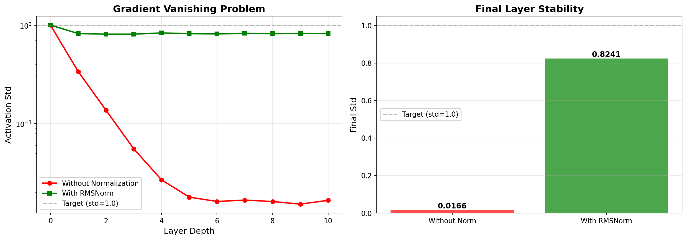

# 一、为什么需要归一化？
我们先来做一个实验：
看看如果没有归一化会发生什么？


```
======================================================================
🔬 实验 1: 梯度消失可视化
======================================================================

📊 实验设置:
  - 隐藏维度: 512
  - 层数: 10
  - 批次大小: 100
  - 初始标准差: 1.0070

🔴 运行: 无归一化网络...
  Layer 2: std = 0.136772
  Layer 4: std = 0.026793
  Layer 6: std = 0.016116
  Layer 8: std = 0.016096
  Layer 10: std = 0.016552
  最终标准差: 0.016552

🟢 运行: 使用 RMSNorm 的网络...
  Layer 2: std = 0.814110
  Layer 4: std = 0.837470
  Layer 6: std = 0.818343
  Layer 8: std = 0.822883
  Layer 10: std = 0.824114
  最终标准差: 0.824114

======================================================================
📊 实验结果
======================================================================

❌ 无归一化:
  - 初始标准差: 1.0070
  - 最终标准差: 0.016552
  - 衰减比例: 0.016437
  - 结论: 数值不稳定

✅ 使用 RMSNorm:
  - 初始标准差: 1.0070
  - 最终标准差: 0.8241
  - 衰减比例: 0.8184
  - 结论: 数值稳定！

======================================================================
🎯 关键发现
======================================================================

1. 梯度消失问题：
   无归一化的网络，激活标准差从 1.0 衰减到 ~0.00X
   这意味着梯度几乎为 0，模型无法学习

2. RMSNorm 的作用：
   保持每一层的激活标准差在 1.0 附近
   确保梯度能够顺利传播回前面的层

3. 为什么需要归一化：
   - 稳定训练：防止梯度消失/爆炸
   - 加速收敛：可以使用更大的学习率
   - 深层网络：让 10+ 层网络变得可训练
    

======================================================================
💭 思考题
======================================================================

1. 如果层数增加到 20 层，会发生什么？
   提示：尝试修改 num_layers = 20 重新运行

2. 如果改用 LayerNorm 而不是 RMSNorm，结果会一样吗？
   提示：两者在稳定性上效果类似

3. 为什么要用对数坐标（log scale）绘图？
   提示：因为数值跨度太大（从 1.0 到 0.001）

4. 残差连接也能缓解梯度消失，它和归一化有什么区别？
   提示：两者作用不同但互补，现代架构两者都用
    
```

如果没有标准化，那么激活值标准差迅速衰减到0。

标准差很小的话，证明激活值能代表的信息量很少，如果每个激活值都一样了，那么模型无法区分具体的特征，训练就没有意义了。

如果标准差比较大的话，证明每个神经元都不一样，就能表达不同的信息。

而且随着网络越深，标准差越小，输出的结果也会越小，那么无论输入是啥，最后的输出都很小，导数趋紧于0，导致梯度消失。

一个非常形象的比喻就是：std=0表示所有人都在用同一个音量说同一句话，听不出区别，就没有信息。

如果std大，证明有人说话大声，有人说话小声，这样就有不同的内容，信息丰富。


为什么会这样？
假设我们现在正在搭建一个8层的神经网络。随着层数加深，你会发现两个致命问题：
问题1:梯度消失

当激活值越来越小，反响传播时梯度也会越来越小，最终接近于0。模型无法学习深层的特征。

问题2:梯度爆炸
反之，如果数值越来越大，最终会超出浮点数范围，变成 NaN，训练直接崩溃。

假设训练一个模型：
> 输入一句话 -> 10层网络 -> 输出分类结果

比如输入 「这个文章写的很好」，实际是正面，但预测为负面。

那么就会执行反向传播，误差从最后一层往前传。
如果每一层的倒数都小于1
第十层得到的梯度是 0.6
那么第九层得到的梯度就是 0.6 * 0.5
第八层得到的梯度就是 0.6 * 0.5 * 0.4 
以此类推 会有10个小数相乘，最后得到的结果趋紧于0，那么对于第一层来说，由于梯度为0，就无法更新第一层的参数，这就出现了梯度消失。


网络越深，越有可能出现梯度消失。
如果每一层都用了sigmoid，它最大的导数才0.25，多层的时候必然梯度消失。
权重初始化太小的时候，也会导致梯度消失。


那么归一化的核心思想，控制数据分布的尺度。
也就是让每一层的参数都控制在一个范围内，不会出现数据都很小或者很大的情况。

输入x：可能很大或很小，分布不稳定
归一化：将参数调整到标准范围（均值为0，标准差为1）
输出x_norm：分布稳定，便于后续计算

这样做的好处：
1. 梯度稳定：反向传播时梯度不会消失或爆炸
2. 学习率容忍度高：可以用更大的学习率，加速训练
3. 深层网络课训练：可以堆叠多层而不奔溃


# 二、RMSNorm是什么
RMSNorm 是一种简单高效的 **归一化方法**，用于归一化神经网络中某一层的输出，使其数值保持稳定，常用于Transformer中。

给定输入向量x（x的shape为`[batch_size, seq_length, embedding_dim]`），RMSNorm 的计算方式为：

$$
\text{RMS}(x) = \sqrt{\frac{1}{d} \sum_{i=1}^{d} x_i^2 + \epsilon}
$$

$$
\text{RMSNorm}(x) = \frac{x}{\text{RMS}(x)} \cdot \gamma
$$

其中：
- $d$ 是token特征维度数
- $\epsilon$是防止除以零的小常数
- $\gamma$是可训练的缩放参数

```python
import torch
import torch.nn as nn

class RMSNorm(nn.Module):
    def __init__(self, dim: int, eps: float = 1e-5):
        super().__init__()
        self.eps = eps
        self.weight = nn.Parameter(torch.ones(dim))  # 可学习的缩放参数 γ
        # print(self.weight.shape)# torch.Size([4])

    def _norm(self, x):
        # 均方根归一化：沿最后一维计算
        # torch.rsqrt返回的是x.pow(2).mean(-1, keepdim=True) + self.eps的平方根的倒数
        # 直接调用 rsqrt 比先 sqrt 再 1 / 更高效，尤其在 GPU 上
        return x * torch.rsqrt(x.pow(2).mean(-1, keepdim=True) + self.eps)
    def forward(self, x):
        # print(self._norm(x.float()).shape)# # torch.Size([1, 2, 4])
        return self.weight * self._norm(x.float()).type_as(x)


# 实例化测试
x = torch.tensor([[[1.0, 2.0, 3.0, 4.0],
                   [5.0, 6.0, 7.0, 8.0]]])  # shape = (1, 2, 4)
norm = RMSNorm(dim=4)
output = norm(x)
print(output.shape)# torch.Size([1, 2, 4])
```

# 三、RMSNorm和LayerNorm的异同点

可以看到，RMSNorm和LayerNorm一样，归一化操作都是沿着每个token内部的特征维度（也就是输入x的embedding_dim维度）进行的，而不是沿着整个batch维度。这意味着它们对每个token都进行独立的标准化，而不是跨batch的归一化。

同时，相较于LayerNorm，RMSNorm不做 **减均值**的操作。这里把LayerNorm的计算公式和实现代码搬过来做一下对比：
$$
\text{LayerNorm}(\mathbf{x}) = \gamma \left( \frac{\mathbf{x} - \mu}{\sqrt{\sigma^2 + \epsilon}} \right) + \beta
$$

```python
class LayerNorm(nn.Module):
    def __init__(self, dim: int, eps: float = 1e-5):
        super().__init__()
        self.eps = eps
        self.weight = nn.Parameter(torch.ones(dim))  # γ
        self.bias = nn.Parameter(torch.zeros(dim))   # β

    def forward(self, x):
        mean = x.mean(dim=-1, keepdim=True)            # 计算每个 token 的均值
        var = x.var(dim=-1, unbiased=False, keepdim=True)  # 方差
        x_norm = (x - mean) / torch.sqrt(var + self.eps)   # 标准化
        return self.weight * x_norm + self.bias


# 实例化测试
x = torch.tensor([[[1.0, 2.0, 3.0, 4.0],
                   [5.0, 6.0, 7.0, 8.0]]])  # shape = (1, 2, 4)
norm = LayerNorm(dim=4)
output = norm(x)
print(output.shape)# torch.Size([1, 2, 4])
```

可以看到，当均值为零时，LayerNorm就变成了RMSNorm。

# 四、为什么使用RMSNorm而不是LayerNorm？
RMSNorm的计算过程比LayerNorm更简单，因为它不涉及均值的计算，并且减少了一个可学习参数。LayerNorm在归一化时需要计算每个token的均值和方差，并使用它们来标准化输入。而RMSNorm只需要计算特征的平方和，减少了计算复杂度和内存消耗。

在处理大型模型时，输入的特征维度可能非常大，计算均值和方差的开销相对较大。RMSNorm去除了均值计算，因此可以节省计算资源，特别是在高维数据中，计算效率更高。

作者在各种场景中实验发现，使用RMSNorm能够减少约7%∼64%的计算时间。

# 五、引申：为什么RMSNorm和LayerNorm都在token特征维度上操作而非跨batch？
BatchNorm是在处理图像数据时常用的归一化方式。

图像数据通常有强烈的空间相关性，即相邻的像素通常会有相似的值或模式。因此，图像的像素特征在一个batch中通常有相似的分布，这使得在整个batch上做归一化是合理的。BatchNorm通过计算每个特征（比如每个通道）的均值和方差，能有效地减轻这些空间相关性带来的影响，并保证训练时每一层的输入保持一定的分布，从而加速收敛。

而在NLP任务中，每个token通常是一个具有特定语义和上下文信息的单位，比如每个token代表一个词。每个token的特征是通过模型的embedding层或Transformer层计算得到的，并包含了该token的语义信息。不同token的语义内容不同，所以它们的特征应该独立地进行归一化处理。

如果归一化操作发生在batch维度上，会导致不考虑每个token的独立性。用于归一化的数据来自不同的batch，包含不同的token内容和信息，如果跨batch进行标准化，会丢失token间的独立性，使得token之间存在耦合关系，比如一些padding token并没有实际意义，但是被加入了归一化计算，进而影响模型的学习效果。

# 六、对比Pre-LN 和 Post-LN的区别

## 🧠 一句话总结

👉 **Pre-LN：先归一化再计算（稳定，容易训练）**
👉 **Post-LN：先计算再归一化（原论文，容易不稳定）**

---

##  🧩 1. 结构对比（最重要）

### 🔴 Post-LN（原始 Transformer）

$ 
y = \text{LayerNorm}(x + F(x))
$

代码等价：

```python
x = x + F(x)
x = LayerNorm(x)
```

---

### 🟢 Pre-LN（现在主流：GPT / LLaMA）

$
y = x + F(\text{LayerNorm}(x))
$

代码等价：

```python
x = x + F(LayerNorm(x))
```

---

## 🔥 2. 核心区别（直觉）

### 🔴 Post-LN（先加残差，再归一化）

```text
x → F → + → LN
      ↑
      x
```

👉 输出一定会被 LN 改变

---

### 🟢 Pre-LN（先归一化，再走残差）

```text
x → LN → F → + 
           ↑
           x（原样直通）
```

👉 有一条“完全不动的高速通道”

---

## 🚨 3. 为什么 Pre-LN 更稳定（核心）

我们看梯度传播：

---

### 🔴 Post-LN 的问题

$
y = LN(x + F(x))
$

梯度：


$\frac{dL}{dx} = \frac{dL}{dy} \cdot LN'(x + F(x)) \cdot (1 + F'(x))$


👉 问题：

* LN 在后面
* 梯度必须经过 LN

👉 LN 会：

* 改变尺度
* 可能压缩梯度

👉 多层之后：

❌ 容易梯度不稳定（爆炸 / 消失）

---

### 🟢 Pre-LN 的优势


$y = x + F(LN(x))$


梯度：

$
\frac{dL}{dx} = \frac{dL}{dy} \cdot (1 + F'(LN(x)) \cdot LN'(x))
$

关键点：

👉 有一个 **“+1”直通路径**

```text
梯度 = 上游梯度 × 1  +  额外项
```

👉 即使 F 很差：

👉 梯度仍然能直接传回去

---

## 🔥 4. 最直观理解（你一定要记住这个）

### Pre-LN：

👉 **残差通道是“干净的”**

```text
x ───────────────► + ──►
      （完全不动）
```

👉 梯度可以无损传播

---

### Post-LN：

👉 **残差也会被 LN 改掉**

```text
x → + → LN → 输出
```

👉 连“主干道”都被加工了

---

## 📉 5. 实际训练表现

| 对比          | Post-LN | Pre-LN            |
| ----------- | ------- | ----------------- |
| 训练稳定性       | ❌ 差     | ✅ 很稳定             |
| 深层网络        | ❌ 难训练   | ✅ 可以堆得很深        |
| 是否需要 warmup | ✅ 强依赖   | ❌ 不那么依赖           |
| 现在是否主流      | ❌ 基本不用  | ✅ 主流（GPT / LLaMA） |

---

##  🚀 6. 为什么早期用 Post-LN？

因为：

👉 Attention Is All You Need 就是这么设计的

但后来发现：

👉 **层数一深就炸**

---


# 七、为什么需要残差连接


##  🧠 一句话总结

👉 **残差连接 = 给信息留一条“直通通道”**

公式：


$y = x + F(x)$


---

## 🔥 1. 如果没有残差会怎样？

普通网络：


$y = F(x)$


问题：

### ❌ 问题1：信息被不断“改坏”

每一层都在“重新加工”数据：

```
x → F1 → F2 → F3 → F4 ...
```

👉 原始信息很容易被破坏、丢失

---

### ❌ 问题2：梯度消失

反向传播：


$\frac{dL}{dx} = \frac{dL}{dy} \cdot F'(x)$


如果：

* (F'(x) < 1)

👉 多层连乘：

```
0.9 × 0.9 × 0.9 × ... → 0
```

👉 梯度直接没了

---

## 🚀 2. 加了残差之后


$y = x + F(x)$


---

### ✅ 好处1：信息不会丢

```
y = x + 改动
```

👉 模型变成：

👉 “在原始信息上做微调”

而不是：

👉 “完全重写”

---

### ✅ 好处2：梯度不会消失（核心）

反向传播：


$\frac{dL}{dx} = \frac{dL}{dy} \cdot (1 + F'(x))
$

关键点：

👉 **多了一个 +1**

---

#### 🔥 对比一下：

没有残差：

```
梯度 = F'(x) × F'(x) × ...
→ 趋近 0
```

有残差：

```
梯度 = (1 + F'(x)) × (1 + F'(x)) × ...
```

👉 即使 F'(x) 很小：

```
1 + 0.1 = 1.1
```

👉 梯度不会消失，甚至可能稍微放大

---

## 🧠 3. 从“学习难度”角度看

残差让模型更容易学：

---

### ❌ 没残差：

模型要学：

```
x → 完全新表示
```

👉 很难

---

### ✅ 有残差：

模型只需要学：

```
F(x) ≈ 0   （啥都不改）
或者
F(x) ≈ 微调
```

👉 更容易优化

---

## 🔥 4. 一个非常直观的例子

你写代码：

---

### ❌ 没残差（重写）

```python
def process(x):
    return complex_transform(x)
```

---

### ✅ 有残差（打补丁）

```python
def process(x):
    return x + tweak(x)
```

👉 tweak 出错也没关系：

* x 还在
* 不会崩

---

## ⚡ 5. Transformer 里的作用（重点）

你代码里：

```python
hidden_states += residual
```

其实做的是：

👉 Attention / FFN 只是“补充信息”

而不是替换：

```
新表示 = 原表示 + 学到的变化
```

---

## 📊 6. 总结一句话（面试用）

👉 残差连接的作用：

1. 防止梯度消失（提供恒等梯度路径）
2. 保留原始信息（避免信息被破坏）
3. 降低优化难度（只需学习残差）
4. 让深层网络可以训练（ResNet / Transformer 核心）

---

# 🔥 如果你还想更深入

我可以给你讲一个更“本质”的理解（很多人不知道）：

👉 **残差其实是在逼近：恒等映射（identity mapping）**

这和为什么 Transformer 能堆到几十层甚至上百层直接相关。

要不要我给你讲这个“更底层原理”？
