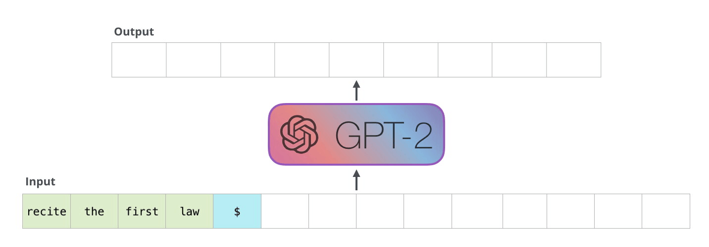
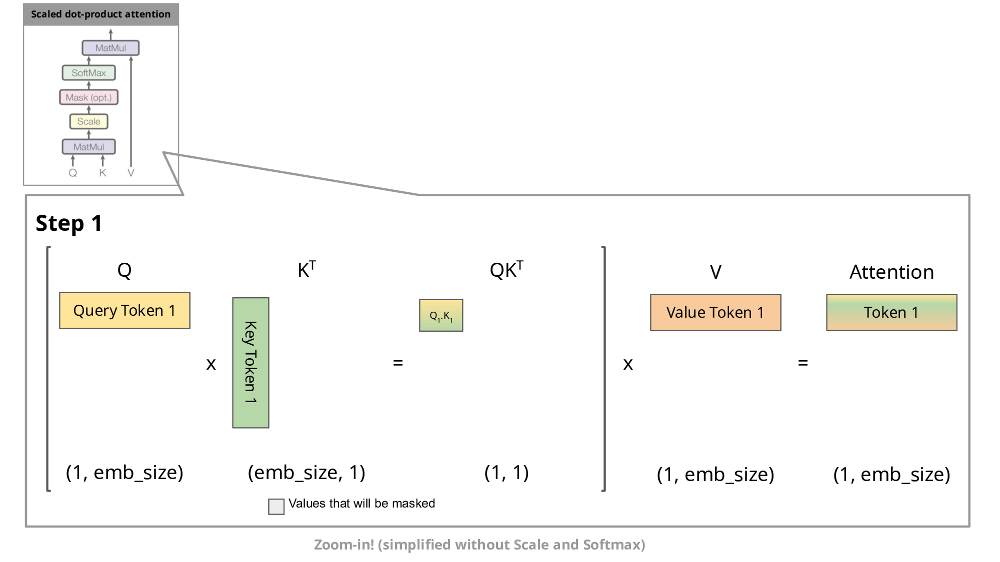
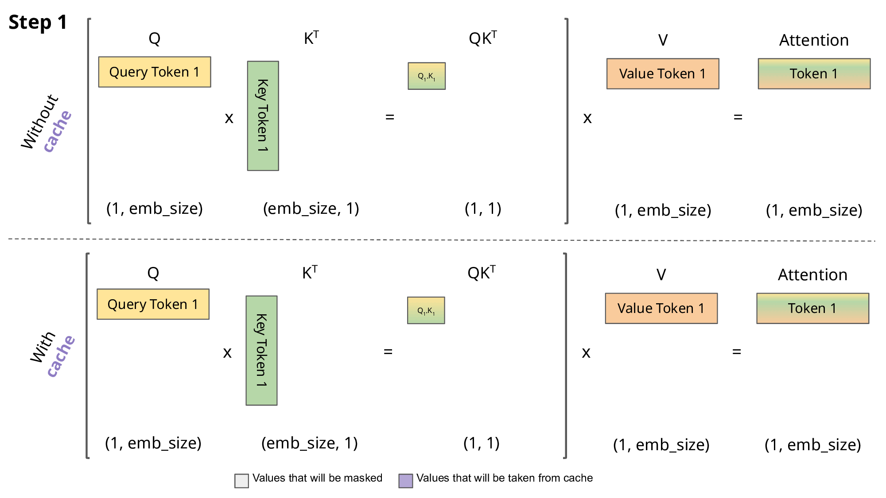
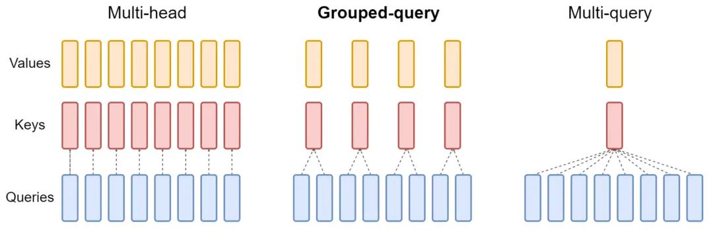

# 一、KV Cache
KV Cache（Key-Value Cache）是在Transformer自回归模型（如GPT）推理阶段中，为了加速推理、减少重复计算而引入的缓存机制。

具体来说，在推理时，为每个生成的token计算K和V矩阵，KV Cache将这些句子存储在内存中，以便在生成后续token时，我们只需为新的token计算K和V，而不是重新计算所有当前已生成的token的K和V。

所以在GPT这种模型推理时，每步只生成1个新的token，但这个token的注意力是对所有历史token做注意力计算。
将新token的query和历史token的key做注意力计算，并且还要得到新token的K和V，都缓存下来。方便下次进行注意力计算。

而且有了KV Cache之后，Transformer中的残差连接、归一化、FFN 都不需要在计算了，他们都是只计算一次就可以了。



在解码器的自回归生成中，给定一个输入，模型预测下一个token，然后在下一步将组合输入进行下一次预测。
这种自回归行为重复了一些操作，可以通过放大解码器中计算的掩码缩放点积注意力计算来更好地理解这一点：


这里对是否使用KV Cache的QK计算过程进行对比：


上图中，紫色是从缓存中读获取的，绿色是计算得到的，灰色是根据掩码机制（当前token只能看到自己以及之前的信息）被mask掉的（因此无需计算）。通过这些动图，可以很清晰的观察到使用KV Cache可以减少很多token的K和V向量的重复计算。

为什么这种优化重要吗？如上图所示，使用KV Cache得到的句子更小，从而加快了矩阵惩罚的速度。唯一的缺点时它需要更多的GPU显存来缓存KV。

让我们使用GPT2观察一下在有无KV缓存情况下的生成速度。

```python
import numpy as np 
import time 
import torch 
from transformers import AutoModelForCausalLM, AutoTokenizer 

device = "cuda" if torch.cuda.is_available() else "cpu" 
tokenizer = AutoTokenizer.from_pretrained("gpt2") 
model = AutoModelForCausalLM.from_pretrained("gpt2").to(device) 

for use_cache in (True, False): 
  times = [] 
  for _ in range(10): # 测量 10 代
    start = time.time() 
    model.generate(**tokenizer("什么是 KV 缓存？", return_tensors="pt").to(device), use_cache=use_cache, max_new_tokens=1000) 
    times.append(time.time() - start) 
  print(f"{'with' if use_cache else 'without'} KV 缓存: {round(np.mean(times), 3)} +- {round(np.std(times), 3)} 秒")
```

我们可以看到，差了快1倍。

> with KV 缓存: 4.083 +- 0.119 秒
without KV 缓存: 7.839 +- 0.014 秒

所以KV Cache的好处不言而喻。

# 二、MHA、MQA、GQA

在Transformer中，每一层的注意力通常是基于多头注意力（Multi-Head Attention，MHA）实现的。这个模块的核心操作时将模型的总隐藏维度拆分成多个头，没个头独立进行注意力计算，然后再将它们的结果拼接回来，投影回原始空间。

通过多头操作，每个头可以专注不同的子空间，模型可以更好的捕捉多种不同的语义/结构关系。多个头并行，相当于多个子空间并行抽取特征，最后拼接后在映射，增强了模型的非线性表达能力。


既然“多头”操作这么有优势，那么为啥还会出现GQA、MQA这种注意力机制呢？

实际上，MHA的并行多头机制虽然表达能力强，但它存在计算和内存上的开销问题。具体表现为：
1. 在标准MHA中，没个头都需要独立的QKV，共三个线性层，存储开销是成倍的。
2. 在推理时，尤其是大模型部署中，每个token都要执行所有头的KV计算并缓存，非常耗显存。
   
为了减少内存占用，出现了MQA，其核心思想是：每个注意力头依然保留独立的Query向量，但所有注意力头共享一组K和V向量。这样大大减少了计算和缓存中KV的冗余部分。尤其在解码器结构中，推理阶段需要缓存每个token的KV，如果每个头都独立缓存，会造成巨大的显存压力，MQA可以显著降低这种开销。

然而，由于K和V只有1个头，所有头的Q都共享者1个K和V，导致每个Query头无法获取独立的上下文信息，只能从同一组KV抽取信息，这在一定程度上限制了模型捕捉多样化注意力模式的能力，尤其是在建模复杂以来关系或多语义对齐时可能效果不如标准MHA。

因此，虽然MQA在计算和显存占用方面具有显著优势，但也带来了表达能力的折损。这正是GQA出现的原因：通过让多个Q头共享部分KV，GQA在保持效率的同时，部分恢复了MHA的灵活性和多样性，是一种性能和效率的折中设计。



注意，在计算注意力时，虽然MQA/GQA 头数少，但计算的时候还是要把KV复制到和Q相同的头数来做注意力计算，所以这三者注意力计算的消耗还是一样的。只是占用的显存不一样了。


但计算量不等于性能损耗，区别主要在：
* KV的投影次数（线性层）少了：MHA每头独立，KV线性投影各做num_heads次,MQA只做一次，GQA做M次（M是一个大于1 & 小于num_heads，且能够被num_heads整除的数）。这样一来， KV cache大幅减少，因为缓存的head 数是1或M，不是num_heads。
* KV的repeat操作可以高效实现：比如FlashAttention可以使用broadcast或index select避免真的物理复制(repeat)。

现在来举个例子，对比三者的存储开销，这里我们只比较注意力中K/V缓存的显存占用（推理时需保留），忽略 Q。

假设总隐藏维度$d_{model}$=4096，num_heads=32，seq_len=1024，batch_size=1，有head_dim=$d_{model}$//num_heads=4096//32=128，在GQA中将总共num_heads=32个Q向量分成8组。

每个float32占用4字节，每种方法的总存储占用（Byte）= `batch_size × num_kv_heads × seq_len × head_dim × float_size`  


| 类型        | num_kv_heads | 计算公式                          | 显存占用（Byte） | 显存占用（MB） |
|-------------|---------------|-----------------------------------|------------------|----------------|
| **MHA**     | 32            | 1×32×1024×128×4 = 16,777,216      | 16,777,216       | **16 MB**      |
| **GQA (8组)** | 8             | 1×8×1024×128×4 = 4,194,304        | 4,194,304        | **4 MB**       |
| **MQA**     | 1             | 1×1×1024×128×4 = 524,288          | 524,288          | **0.5 MB**     |


# 三、Flash Attention

Flash Attention 是大模型里一个非常核心的Attention计算优化算法。它不在显示构造 nxn 注意力矩阵，而是在GPU上分块计算 softmax + matmul，减少显存读写。

标准Attention的问题：
Q^K注意力计算产生的 N x N 矩阵，非常大。加入N是4096，那么矩阵大小是 1670万个参数。

而且还要拿着这个计算得到的 注意力矩阵 来计算softmax分数。
所以这个 注意力矩阵 必须存 GPU 显存。


Flash Attention 如何改进？

简单来说，就是一次放不下，那分批次放。
它不存 N x N矩阵，而是分快计算，在线softmax。

1. 分块
把KV分快：
> k1、k2、k3
> v1、v2、v3

对于每个token的Q矩阵，将Q矩阵和每一个k单独计算得到注意力分数score，然后计算softmax。

我们知道softmax = exp / sum(exp)
我们现在只知道某一个分数，怎么计算它的分母呢？


首先我们需要确定一下，在注意力机制中，softmax是如何计算的？

首先exp有一个特点：增长极快
exp(10) ≈ 22000
exp(100) ≈ 10^43
exp(1000) ≈ 爆炸到无法表示

如果直接计算exp的话，那么会导致结果巨大，甚至无法计算。
而且会占用巨大的显存，结果可能inf或者nan。

所以为了避免这种情况，在计算的时候让所有的score先减去最大值，然后才计算exp。
为什么可以这样呢，因为 exp(a - b) = exp(a) / exp(b)
那么每个元素都 / exp(b)
那么分子分母都除于同一个数，结果不变。
这样做的好处是，所有的数都小于等于0，那么在计算exp的时候，
exp(0) = 1
exp(负数) = 小于1 
这样所有的数在0-1之间。
这样计算的softmax不会出错。

那么对于我们的flash attention来说，只需记录最大值和分母
我们是每次计算一块
假设一块，scope1 = 3
最大值 m = 3
分母 l = exp(3 - 3)
输出 O = exp(3 - 3) * V1

那么第二块： B = 5
此时，最大值已经发生了变化，那么怎么办呢。
对于A来说，本来是 exp(3-3),但现在需要改成 exp(3-5)
但是我们已经不保存A的值了，我们只保存最大值，所以我们不知道原先保存的是什么元素
但是我们可以根据exp的性质计算
exp(3-5) = exp(3 - 3) * exp(3 - 5)
exp(3 - 3) 是之前计算得到值
而exp(3 - 5) 中的3是之前得到的最大值，而 5 是当前的最大值

所以 针对遇到了新的最大值
score2 = 5
最大值 m_new = max(m_old, scpre2) = max(3, 5) = 5
分母 l_new = l_old * exp(m_old - m_new) + exp(5 - 5)
输出 O_new = O_old * exp(m_old - m_new) + exp(5 - 5) * V2

当所有的元素计算完成之后，
O_findal = O_new / l_new

这样就得到了 整个注意力计算的结果

这是真的很巧妙，也不需要存所有的分数，那么相比传统注意力计算需要的 N * N 矩阵，我们最多 N
每个token 只需要计算最大值和分母。


# 代码实现
```python
from typing import Optional, Tuple, List, Union
import torch.nn.functional as F

def repeat_kv(x: torch.Tensor, n_rep: int) -> torch.Tensor:
    """torch.repeat_interleave(x, dim=2, repeats=n_rep)"""
    bs, slen, num_key_value_heads, head_dim = x.shape
    if n_rep == 1:
        return x
    return (
        x[:, :, :, None, :]
        .expand(bs, slen, num_key_value_heads, n_rep, head_dim)
        .reshape(bs, slen, num_key_value_heads * n_rep, head_dim)
    )

class Attention(nn.Module):
    def __init__(self, args):
        super().__init__()
        # 支持多query-head共享同一个key/value-head
        self.num_key_value_heads = args.num_attention_heads if args.num_key_value_heads is None else args.num_key_value_heads
        assert args.num_attention_heads % self.num_key_value_heads == 0

        self.n_local_heads = args.num_attention_heads  # 总的 attention head 数
        self.n_local_kv_heads = self.num_key_value_heads  # k/v head 数
        self.n_rep = self.n_local_heads // self.n_local_kv_heads  # 每个 k/v head 被多少个 query head 共享

        self.head_dim = args.hidden_size // args.num_attention_heads  # 每个 head 的维度

        # QKV线性映射层，不使用 bias
        self.q_proj = nn.Linear(args.hidden_size, args.num_attention_heads * self.head_dim, bias=False)
        self.k_proj = nn.Linear(args.hidden_size, self.num_key_value_heads * self.head_dim, bias=False)
        self.v_proj = nn.Linear(args.hidden_size, self.num_key_value_heads * self.head_dim, bias=False)
        self.o_proj = nn.Linear(args.num_attention_heads * self.head_dim, args.hidden_size, bias=False)

        # dropout
        self.attn_dropout = nn.Dropout(args.dropout)
        self.resid_dropout = nn.Dropout(args.dropout)
        self.dropout = args.dropout

        # 是否启用 Flash Attention（PyTorch >= 2.0）
        self.flash = hasattr(torch.nn.functional, 'scaled_dot_product_attention') and args.flash_attn

    def forward(self,
                x: torch.Tensor,  # 输入特征: [bsz, seq_len, hidden_size]
                position_embeddings: Tuple[torch.Tensor, torch.Tensor],  # rotary pos embedding 的 cos/sin
                past_key_value: Optional[Tuple[torch.Tensor, torch.Tensor]] = None,  # kv缓存
                use_cache=False,  # 是否返回 kv_cache
                attention_mask: Optional[torch.Tensor] = None):  # attention 掩码（padding的token不参与注意力计算）

        bsz, seq_len, _ = x.shape

        # 线性变换 -> Q, K, V
        xq = self.q_proj(x)  # [bsz, seq_len, n_heads * head_dim]
        xk = self.k_proj(x)  # [bsz, seq_len, n_kv_heads * head_dim]
        xv = self.v_proj(x)  # [bsz, seq_len, n_kv_heads * head_dim]

        # reshape 为多头格式
        xq = xq.view(bsz, seq_len, self.n_local_heads, self.head_dim)
        xk = xk.view(bsz, seq_len, self.n_local_kv_heads, self.head_dim)
        xv = xv.view(bsz, seq_len, self.n_local_kv_heads, self.head_dim)

        # 应用 rotary position embedding
        cos, sin = position_embeddings
        # cos和sin是预计算的很长的一段，这里只截取前seq_len，因为最大pos就是seq_len-1
        xq, xk = apply_rotary_pos_emb(xq, xk, cos[:seq_len], sin[:seq_len])

        # 处理 KV 缓存：将历史的 key/value 与当前拼接(训练时不需要)
        if past_key_value is not None:
            xk = torch.cat([past_key_value[0], xk], dim=1)  # time 维度拼接
            xv = torch.cat([past_key_value[1], xv], dim=1)

        past_kv = (xk, xv) if use_cache else None # xk/xv：[bsz, seq_len, self.n_local_kv_heads, self.head_dim]

        # KV head 重复扩展 -> 让所有 Q head 对应到正确的 KV head
        xq = xq.transpose(1, 2)  # [bsz, n_heads, seq_len, head_dim]
        xk = repeat_kv(xk, self.n_rep).transpose(1, 2)  # [bsz, n_heads, seq_len, head_dim]
        xv = repeat_kv(xv, self.n_rep).transpose(1, 2)  # [bsz, n_heads, seq_len, head_dim]

        # Flash Attention 方法（更快更省内存）
        if self.flash and seq_len != 1:
            dropout_p = self.dropout if self.training else 0.0
            attn_mask = None
            if attention_mask is not None:
                attn_mask = attention_mask.view(bsz, 1, 1, -1).expand(bsz, self.n_local_heads, seq_len, -1)
                attn_mask = attn_mask.bool()

            # 使用 PyTorch 原生 flash attention（内置 causal）
            output = F.scaled_dot_product_attention(
                xq, xk, xv,
                attn_mask=attn_mask,
                dropout_p=dropout_p,
                is_causal=True
            )

        # 普通 attention 方法
        else:
            # 注意力分数计算
            scores = (xq @ xk.transpose(-2, -1)) / math.sqrt(self.head_dim)  # [bsz, n_heads, q_len, k_len]

            # 添加上三角 mask，实现 causal attention
            scores = scores + torch.triu(
                torch.full((seq_len, seq_len), float("-inf"), device=scores.device),
                diagonal=1
            ).unsqueeze(0).unsqueeze(0) # scores+mask， 上三角变成-inf，经过softmax后趋于0，从而遮盖未来信息

            # attention 掩码（如 padding mask）
            if attention_mask is not None:
                extended_attention_mask = attention_mask.unsqueeze(1).unsqueeze(2)  # [bsz,seq_len]-->[bsz,1,1,seq_len]
                extended_attention_mask = (1.0 - extended_attention_mask) * -1e9 # 需要掩的位置是0，现在变成了-1e9，非常小
                scores = scores + extended_attention_mask # 掩的位置后面经过softmax就近似为0了

            # softmax + dropout
            scores = F.softmax(scores.float(), dim=-1).type_as(xq)
            scores = self.attn_dropout(scores)

            # 注意力加权求和
            output = scores @ xv  # [bsz, n_heads, q_len, head_dim]

        # 还原输出形状，并通过输出线性层
        output = output.transpose(1, 2).reshape(bsz, seq_len, -1)
        output = self.resid_dropout(self.o_proj(output))

        return output, past_kv
```

